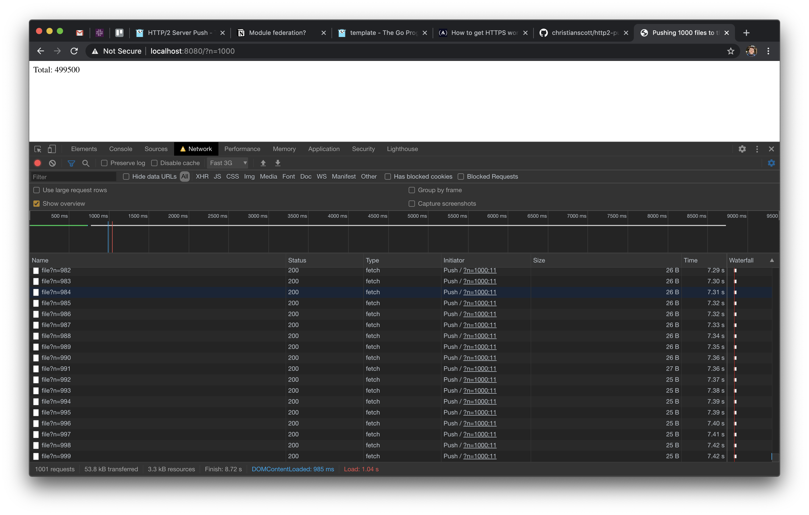

# HTTP/2 Push Upper Limit Test Server

## Usage

1. Generate `localhost.crt` and `localhost.key`:

```sh
$ openssl req -x509 -out localhost.crt -keyout localhost.key \
  -newkey rsa:2048 -nodes -sha256 \
  -subj '/CN=localhost' -extensions EXT -config <( \
   printf "[dn]\nCN=localhost\n[req]\ndistinguished_name = dn\n[EXT]\nsubjectAltName=DNS:localhost\nkeyUsage=digitalSignature\nextendedKeyUsage=serverAuth")
```

2. Run the server without HTTP/2 enabled:

```sh
$ go run main.go -enablePush=false
```

3. Visit https://localhost:8080/?n=1000

4. Restart the server with push enabled & visit the page again:

```sh
$ go run main.go -enablePush=true
```

## Results (1k files, fast 3G)

With push:



Without push:


